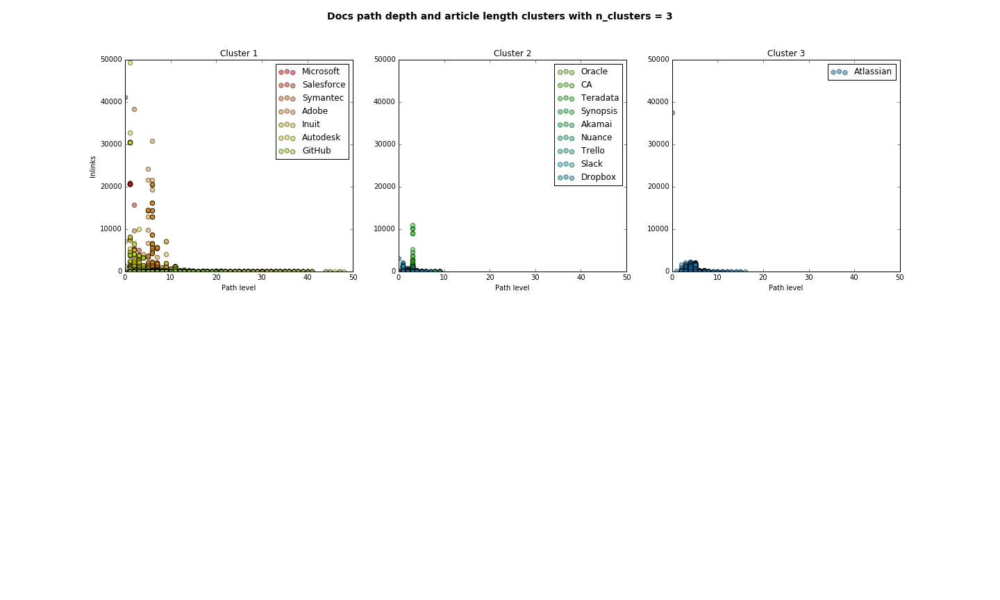

# tecdocs
Enterprise software documentation analysis

### Enterprise software documentation: workbook

###### Compares public facing documentation websites of consumer enterprise software companies on the Fortune 500 2015 list as well as Atlassian and a handful of single-product competetors.
- This initial exploration looks at average article length for the docs sets, as well as the range of different article lengths a docs set has (article length distributions)
- Games, entertainment and non-consumer docs excluded
- Doc set and article size distributions are varied across the different companies and could be used as predictor of software complexity or other
- No clear candidates for a regression analysis in the docs data yet (but some small trends for Alexa web traffic rank)
- Cluster graph on distribution parameters seemed to identify 4 docs set groups.

###### Workbook steps:
    1. Read in docs sitemaps
        * a) Notes on sitemaps
        * b) Check requests status
        * c) Remove bad requests
        * d) Remove word counts < 50
	* e) Number of html pages in each doc site
	* f) Graph total docs pages
    2. Distributions of article length
        * a) Plot doc set article length distributions

        * b) Descriptive statistics of article word count
        * c) Test distribution normalility/ pairwise - not finished   
    3. Regression tests
        * a) Load company data add docs metrics  
	* b) Scatter plots

        * c) RANSAC regression analysis
        * d) Graph regression: shareprice & web traffic
        * e) Graph regression: article length & web traffic
       
| RANSAC regression  |    |
| ------------- |:-------------:|
|  |  |
|    ||

    4. Cluster analysis 
    
| KMeans clusters |               |
| -------------   |:-------------:|
|  |  |
        * a) Plot clusters in 2d (mean, skew)
        * b) 3D cluster plot
        * c) Article length distribution clusters
        * d) Test best number of clusters - not finished
    5. Preliminary results

        * Regression analysis of Alexa web traffic rank, shareprice and mean article length
	* KMeans clusters for article length distributions
	
        
##### Next steps
    1. Pull in article text with docs_text_scrape.py for NLP analysis
    2. Additional steps on company/docs research and cleaning sitemap data - specifically, more qualitative metrics around of type of software & docs sets from NLP analyses
    3. To what extent are documentation factors associated with company profitability (if at all)?
    4. Predict revenue/shareprice for non-listed companies based on docs factors?
    5. Create model of docs style for software types
    5. Decision tree for legacy management/ docs design type
    
##### Improvements:
    * Indexing DataFrame's - got stuck on finding less manual ways to concat, plot etc
    * Cleaning up HTML data other than status, seperate content indexes (landing pages) from articles 

##### Idea: Decision tree for legacy management or docs structure changes
Notes for an additional analysis not included in this project
* Use Google analytics intergration with SEO spider to plot traffic density each CAC page & directory
* Develop a traffic threshold that could guide us in legacy management - I.e. spaces below a certain threshold can be archieved as PDF files
        
